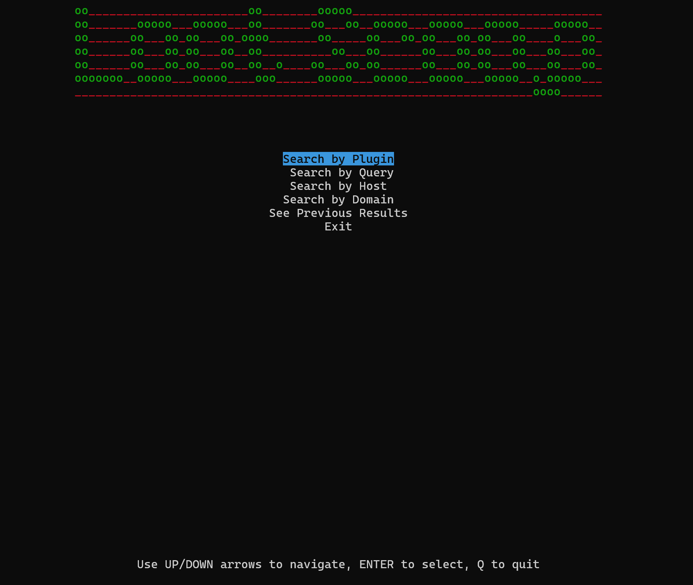

# LootScoop - Like Recon but FUN
[](https://www.python.org/)
[](LICENSE)

LootScoop is a powerful, curses-based command-line tool designed to hunt for Elasticsearch vulnerabilities and leaks with ease. Whether you're a security researcher, a developer, or just curious about the security landscape of Elasticsearch instances on the internet, LootScoop provides the tools you need to navigate, explore, and analyze potential security exposures.

## Features

- **Interactive Interface**: Navigate through search results using an intuitive curses-based UI.
- **Elasticsearch Focus**: Specialized to detect and interact with Elasticsearch vulnerabilities like `ElasticSearchOpenPlugin`.
- **Query Customization**: Search by plugin, custom queries, host, or domain with pagination support.
- **Index Inspection**: List and select Elasticsearch indices for quick data peeks without overwhelming your system.
- **Data Visualization**: Tree-view structure for results allowing for easy navigation and understanding of complex data hierarchies.
- **Colorful Terminal Output**: Enhances readability with color-coded elements for different types of information.
- **Safety First**: Designed with security in mind, ensuring you only deal with what you want to see.

## Installation

**Prerequisites:**
- Python 3.x
- `curses` library (comes pre-installed with Python on most Unix systems)
- `requests` library for API interactions

**Installation Steps:**

```sh
git clone https://github.com/your-username/LootScoop.git
cd LootScoop
pip install -r requirements.txt  # Install dependencies
```

## Usage
Run the Script:
```
python lootscoop.py
```

## Navigate the Menu:
Use the UP/DOWN arrows to select options.
Press ENTER to execute a search or action.
Q to quit.
## Search Operations:
>Search by Plugin: Choose from a predefined list of plugins to hunt for specific vulnerabilities.
>Search by Query: Input your custom YQL (LeakIX Query Language) queries for broader scans.
>Search by Host/IP: Direct searches for specific hosts or IPs.
>Search by Domain: Explore vulnerabilities associated with domains.
Interaction with Results:
Navigate through results in a tree-like structure.
Press ENTER on specific nodes for further actions like index listing or data inspection.

## Configuration
Edit the API_KEY in lootscoop.py with your actual LeakIX API key to leverage full capabilities of the tool.

Screenshots



Note: Replace screenshots/main_menu.png, etc., with actual paths to your screenshot files.

Contributing
Contributions are welcome! Here's how you can contribute:

Open an issue to report bugs or suggest features.
Fork the repository, make your changes, and submit a pull request.

Please read CONTRIBUTING.md for detailed guidelines.

License
This project is licensed under the MIT License - see the LICENSE file for details.

Acknowledgments
LeakIX for providing the API to search for leaks.
The Python community for excellent libraries like curses and requests.

Support
For support, please open an issue or reach out via [your-contact-info].

Enjoy hunting leaks with LootScoop! 🔍
